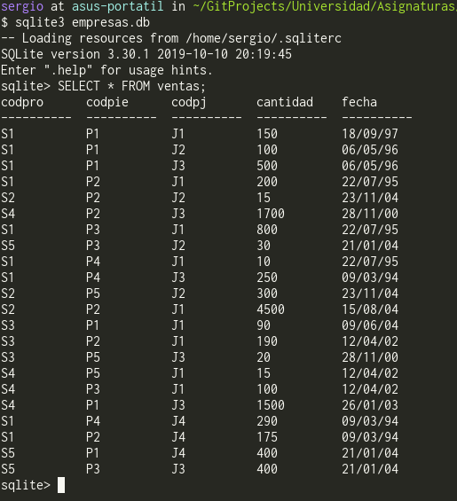

# Descripción del problema y motivación

Este cuatrimestre hemos cursado la asignatura de Fundamentos de Bases de Datos. En las prácticas de dicha asignatura hemos trabajado con `SQL`. Para ello se nos ha dado un cuaderno de ejercicios para trabajar con las bases de datos. A la hora de construir las bases de datos, se nos ha mostrado el *output* esperado al consultar todos los datos de las tablas. Por ello, hemos construido un programa con `LEX` que toma como *input* un fichero de texto con el formato que `SQL` muestra tras hacer una consulta (`SELECT * FROM tabla;`) y que como *output* genera un comando `SQL` para insertar los datos en una tabla (`INSERT INTO tabla VALUES (campo1, campo2, ..., campo_n);`).

En *Figure 1*, se muestra una captura de pantalla que muestra el formato de las consultas `SQL`:

# Algunos detalles

* Como Sistema Gestor de Bases de Datos estamos usando [sqlite](https://www.sqlite.org/index.html)
* Para mayor facilidad a la hora de la programación, en los ficheros de entrada consideramos también el texto del *prompt*: `sqlite> consulta ... sqlite>`, tanto del inicio como del final, para tener control de inicio y fin. Esto se puede entender mejor viendo la forma de las consultas en *Figure 1*.
* El *prompt* de los Sistemas de Gestión de Bases de Datos suelen ser de la forma `*sql*>`, como por ejemplo, `sql>`, `sqlite>`, `mysql>`. Así que tomamos esta consideración para darle una mayor generalidad a nuestro programa (para que no estemos limitados únicamente a `sqlite`).
* Suponemos que los campos que pueden contener texto separado por blancos están entrecomillados. Esto depende de cada Sistema Gestor de Base de Datos, pero en la mayoría esta opción es configurable y de hecho es una buena idea para evitar ambigüedades.

# Comprobación de la solución

En el directorio `/test_files` se encuentran ficheros `.txt` con resultados de algunas de las consultas `SQL` que hemos hecho durante las prácticas de Fundamentos de Bases de Datos, sobre los que se puede ejecutar nuestro programa para comprobar la validez de este.
